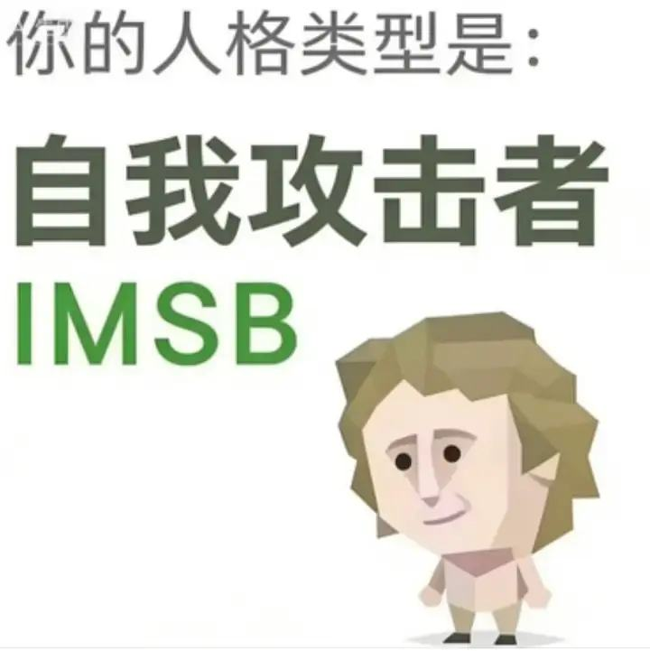

# SBTI：赛博嘴替人格测试



这是一个把 `https://sbti.fancc.de5.net/` 复刻到本地和微信小程序的项目。

一句话介绍：
测完你可能更懂自己，也可能只是更想吐槽自己。

## 这里有什么

- 网页版：打开就能测，主打一个轻松开喷
- 微信小程序版：题目、结果页、分享图全都有
- 结果海报：包含人格图、分析文案、维度评分
- 转发功能：可直接分享结果图给朋友

## 项目气质

- 不装学术
- 不搞说教
- 只负责有趣（和一点点扎心）

## 本地启动（网页版）

```bash
python -m http.server 8000
```

然后访问：`http://localhost:8000`

## 小程序说明

- 代码在 `miniprogram/`
- 结果图里已经预留“小程序码”区域
- 想换成你自己的真实小程序码，替换这个文件即可：
  - `miniprogram/assets/mini/mini-code.jpg`

---

仅供娱乐，请勿用于严肃心理诊断。
